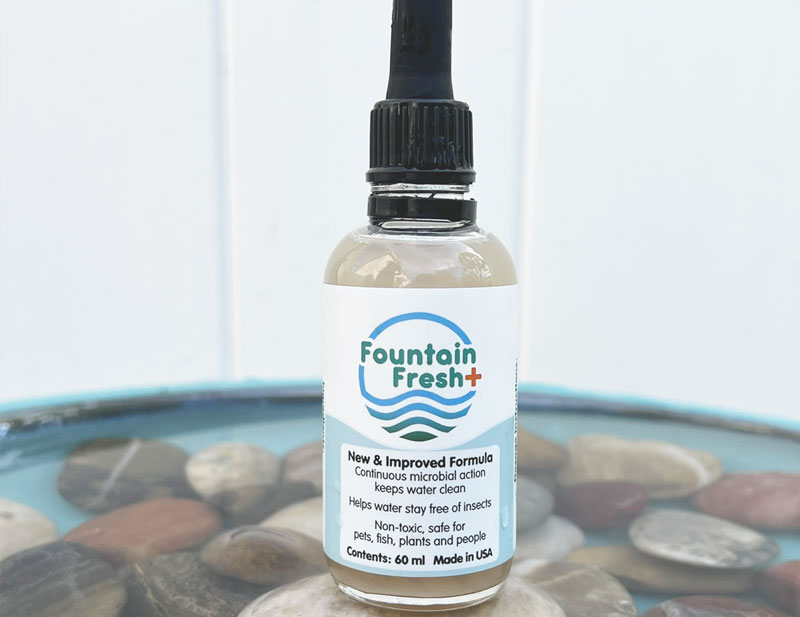
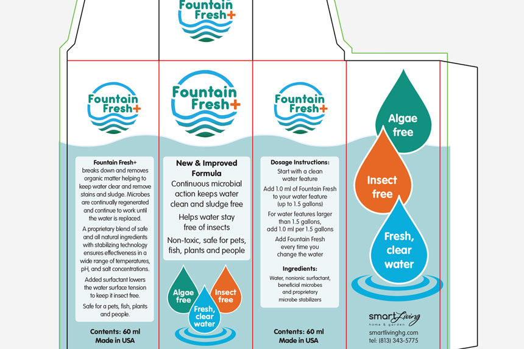

<is-land on:visible>

## Lead Designer

# Logo Design, Packaging, + Branding

## Overview
			
I created the logo, label and box for Smart Living Home & Garden's water purifying solution called Fountain Fresh Plus.

</is-land>

	
		<is-land on:visible>
			
		</is-land>
	
	

		

			<is-land on:visible>
				
			</is-land>
		

		

			<is-land on:visible>
				
			</is-land>
		

		
				
			<is-land on:visible>
				
			</is-land>
		

	

	<is-land on:visible>
		
	</is-land>
	<is-land on:visible>
		
	<is-land on:visible></is-land>

